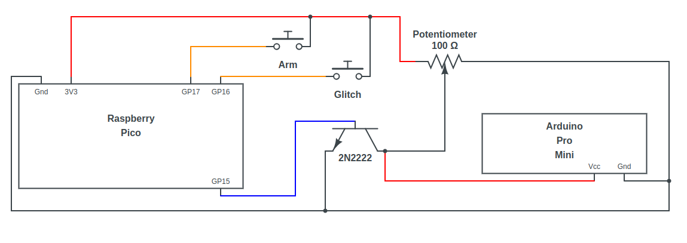
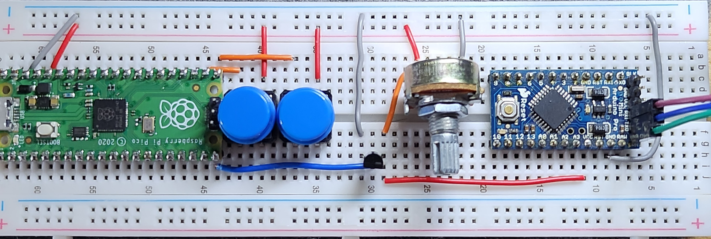

# FaultInjectionLab

## Materials

- Arduino Pro Mini 3.3V
- Raspberry Pico
- 10K Ohm potentiometer
- 2 push buttons
- NPN 2N2222 transistor
- USB-TTL Adapter

## Getting started
Clone this repo:

```
git clone https://github.com/ogianatiempo/FaultInjectionLab.git
git submodule update --init
cd pico-sdk
git submodule update --init
```

Install the prerequisites:

```
sudo apt update
sudo apt install cmake gcc-arm-none-eabi libnewlib-arm-none-eabi build-essential gcc-avr avrdude
```

Build the attacker code:

```
cd ../attacker
mkdir build
cd build
cmake ..
make
```

Connect the Raspberry Pico to your computer while holding the `BOOTSEL` button to enter mass storage device mode. Then copy `power_glitch/power_glitch.uf2` to the Raspberry Pico, for example:

```
cp power_glitch/power_glitch.uf2 /media/octa/RPI-RP2/
```

Disconnect the Raspberry Pico and connect the Arduino Pro Mini using the USB-TTL adapter:

| Arduino | Adapter |
|---------|---------|
| Gnd     | Gnd     |
| Vcc     | 3V3     |
| TX0     | RXD     |
| RX1     | TXD     |
| GRN     | DTR     |

> Note: If your adapter supplies 5V you have to connect it to the RAW pin on the Arduino.

Build and flash the victim code:

```
cd ../../victim/00_loop/
DEVPATH=/dev/ttyUSB0 make flash
```

> The path for your usb adapter might vary, in that case replace `/dev/ttyUSB0` with the correct path.

Disconnect the Arduino Pro Mini and connect all the other parts as shown in this schematic and in the picture:





Connect the Raspberry Pico and the Arduino Pro Mini to the computer again. This time connecting only Gnd, Txd and Rxd for serial communication with the Arduino and run `picocom -b 9600 [usb adapter path]`. You should see the output from the victim's code.

```
$ picocom -b 9600 /dev/ttyUSB0 
picocom v3.1

port is        : /dev/ttyUSB0
flowcontrol    : none
baudrate is    : 9600
parity is      : none
databits are   : 8
stopbits are   : 1
escape is      : C-a
local echo is  : no
noinit is      : no
noreset is     : no
hangup is      : no
nolock is      : no
send_cmd is    : sz -vv
receive_cmd is : rz -vv -E
imap is        : 
omap is        : 
emap is        : crcrlf,delbs,
logfile is     : none
initstring     : none
exit_after is  : not set
exit is        : no

Type [C-a] [C-h] to see available commands
Terminal ready
Booting...
c == 10000
c == 10000
c == 10000
c == 10000
c == 10000
c == 10000
```

Now you are ready to glitch by pressing the buttons, first `Arm` and then `Glitch`. To achieve a succesful glitch you can adjust the initial voltage with the potentiometer.

## References and links

- Inspiration comes from [Hardware Power Glitch Attack (LiveOverflow)](https://www.youtube.com/watch?v=6Pf3pY3GxBM)
- Other ideas, victim's makefile and part of the victim's code comes from [Differential Fault Injection Against AES on Atmega328 (ROT256)](https://rot256.dev/post/glitch/)

Other resources and more info about fault injection in general:

- [The Hardware Hacking Handbook: Breaking Embedded Security with Hardware Attacks (Jasper van Woudenberg y Colin O'Flynn)](https://nostarch.com/hardwarehacking)
- [Fault Injection using Crowbars on Embedded Systems](https://eprint.iacr.org/2016/810.pdf)
- [An introduction to fault injection (NCC Group)](https://research.nccgroup.com/2021/07/07/an-introduction-to-fault-injection-part-1-3/)
